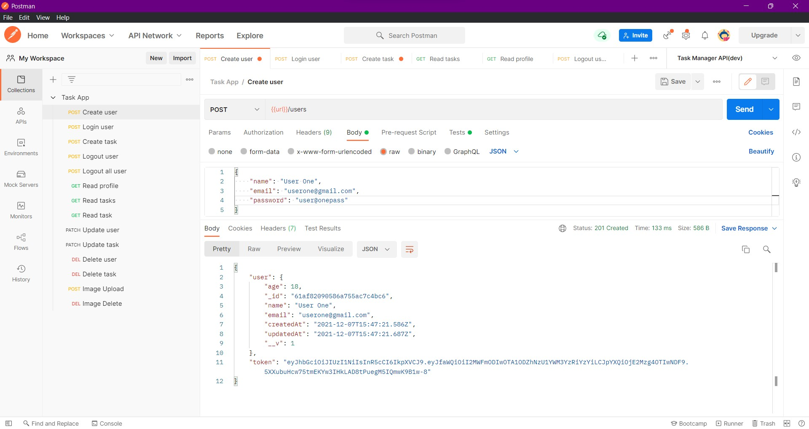
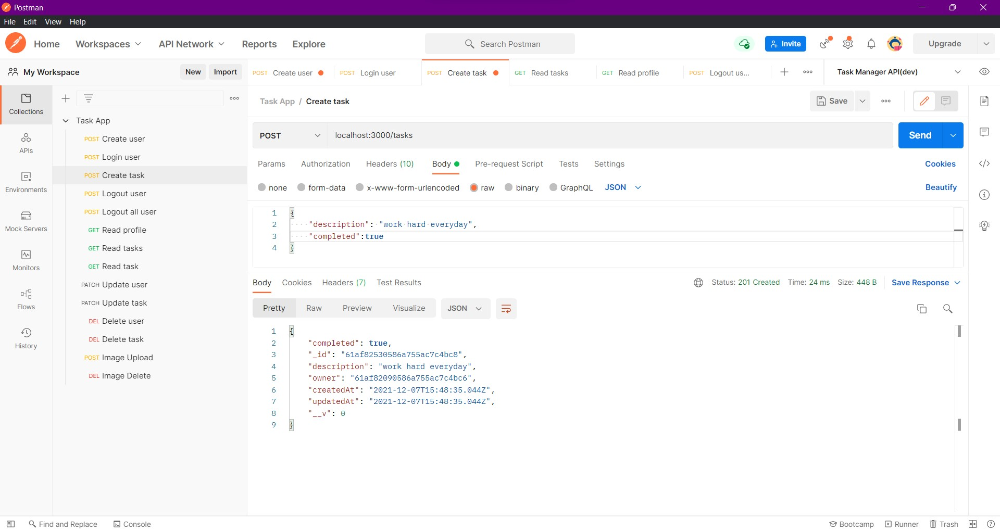
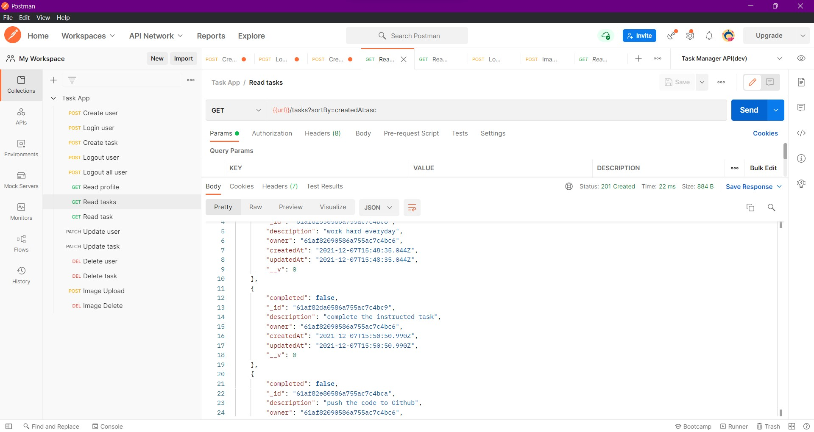

# Node JS Task Manager API

This Node Js project consists two models users and tasks where tasks are linked to the user that created them. Different types of requests such as GET,POST,PATCH,DELETE,etc. can be made through Postman and finally a authentication middleware is included as well to make sure user cannot perform CRUD opertions on tasks before logging in with correct credentials. 


## Demo

Request List and Create User




Login


Create task





View tasks





## Run Locally

Clone the project

```bash
  git clone git@github.com:KushalRaut/task-manager-api.git
```

Go to the project directory

```bash
  cd task-manager-api
```

Install dependencies

```bash
  npm install
```

Start the server

```bash
  npm run dev
```

